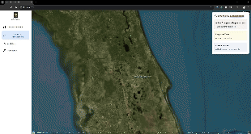

# UCF Campus Digital Twin Application  

This repository contains a **base application** for a **modern campus digital twin** of the University of Central Florida (UCF). The application is built with **Cesium**, **React**, and **TypeScript**, offering a foundation for developers and researchers to expand upon for their specific use cases.  

<div align="center">
  
</div>

---

## **Key Features**  

### **3D Visualization**  
- **Interactive 3D Map**: Visualize UCF's campus in an immersive 3D environment.  
- **Smooth Camera Animations**: Navigate seamlessly across different campus views.  
- **Base Layer Options**: Switch between multiple map styles for varied perspectives.  

### **User Interface**  
- **Modern Sidebar**: Clean, branded navigation menu designed with UCF's identity.  
- **Intuitive Navigation**: Effortlessly switch between views and explore features.  
- **Responsive Design**: Optimized for desktops, tablets, and mobile devices.  

### **Analytics**  
- **Real-Time Occupancy Tracking**: Visualize live occupancy data across campus facilities.  
- **Emergency Response Coverage**: Monitor coverage areas for responders in real time.  
- **Interactive Charts and Graphs**: Gain insights with dynamic analytics tools.  

### **Emergency Management**  
- **Responder Distribution Visualization**: Track the locations of emergency responders.  
- **Campus Overview**: View key locations and resources across the campus.  
- **Real-Time Monitoring**: Integrate live data for enhanced situational awareness.  

---

## **Tech Stack**  

### **Core Libraries and Frameworks**  
- **Cesium**: For 3D visualization of the campus environment.  
- **React**: Modular and declarative UI framework.  
- **TypeScript**: Ensures type safety and better developer experience.  

### **Supporting Tools**  
- **Recharts**: Interactive charts and data visualization.  
- **Zustand**: Lightweight state management.  
- **Tailwind CSS**: Modern, utility-first CSS framework for styling.  

---

## **Development Setup**  

### **Requirements**  
- **Node.js** 
- **npm** 

### **Steps to Run Locally**  
1. Clone the repository:  
   ```bash
   git clone https://github.com/your-repo/ucf-digital-twin.git
   cd ucf-digital-twin
